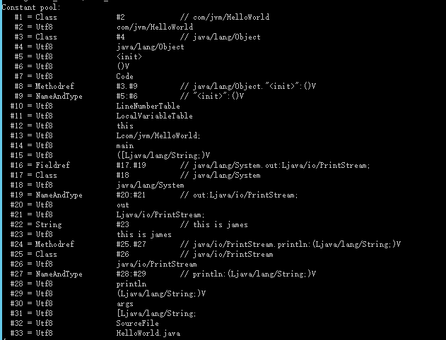

## 无关型基石

* <font color="#1cc552">各种不同平台的虚拟机与所有平台都统一使用的程序存储格式——字节码（ByteCode）是构成平台无关性的基石。</font>实现语言无关性的基础仍然是虚拟机和字节码存储格式，Java虚拟机不和包括Java在内的任何语言绑定，它只与“Class文件”这种特定的二进制文件格式所关联，Class文件中包含了Java虚拟机指令集和符号表以及若干其他辅助信息
* 1个字节等于8位二进制，它是一个8位的二进制数，是一个很具体的存储空间
* Class文件是一组以8位字节为基础单位的二进制流
* 根据Java虚拟机规范的规定，Class文件格式采用一种类似于C语言结构体的伪结构来存
储数据，这种伪结构中只有两种数据类型：<font color="#1cc552">无符号数和表</font>
* 无符号数属于基本的数据类型，以u1、u2、u4、u8来分别代表1个字节、2个字节、4个
字节和8个字节的无符号数，无符号数可以用来描述<font color="#1cc552">数字、索引引用、数量值或者按照UTF-8编码构成字符串值</font>
* 表是由多个无符号数或者其他表作为数据项构成的复合数据类型，所有表都习惯性地
以“_info”结尾。表用于描述有<font color="#1cc552">层次关系的复合结构的数据</font>，整个Class文件本质上就是一张表

##魔数与Class文件的版本

* <font color="#1cc552">每个Class文件的头4个字节称为魔数（Magic Number），它的唯一作用是确定这个文件是否为一个能被虚拟机接受的Class文件</font>,安全考虑,0xCAFEBABE

* 紧接着魔数的4个字节存储的是Class文件的版本号,第5和第6个字节是次版本号（Minor
Version），第7和第8个字节是主版本号（Major  Version）,Java的版本号是从45开始
的，JDK 1.1之后的每个JDK大版本发布主版本号向上加1（JDK 1.0～1.1使用了45.0～45.3的版本号），<font color="#1cc552">高版本的JDK能向下兼容以前版本的Class文件，但不能运行以后版本的Class文件，即使文件格式并未发生任何变化，虚拟机也必须拒绝执行超过其版本号的Class文件</font>

## 常量池
* 紧接着主次版本号之后的是常量池入口，常量池可以理解为Class文件之中的资源仓库，
它是Class文件结构中与其他项目关联最多的数据类型，也是占用Class文件空间最大的数据项目之一，同时它还是在Class文件中第一个出现的表类型数据项目

* 常量池中存放的两大常量

> 字面量和符号引用<br>
> 1. 字面量：java语言中的文本字符串，申明的fianl的常量值<br>
> 2. 符号引用则属于编译方面的概念，类和接口的全限定名，字段的名称和描述符，方法的名称和描述符，而是在虚拟机加载Class文件的时候进行动态连接。也就是说，在Class文件中不会保存各个方法、字段的最终内存布局信息，因此这些字段、方法的符号引用不经过运行期转换的话无法得到真正的内存入口地址，也就无法直接被虚拟机使用。当虚拟机运行时，需要从常量池获得对应的符号引用，再在类创建时或运行时解析、翻译到具体的内存地址之中。<br>
> 3. Oracle公司已经为我们准备好一个专门用于分析Class文件字节码的工具：javap

```shell
# 举例
javap -verbose HelloWorld.class
```

4. javap 命令输出表<br>
<br>

5. 计算机已经帮我们把整个常量池的33项常量都计算了出来,没有在Java代码里面直接出现过,如“I”、“V”、“＜init＞”、“LineNumberTable”、“LocalVariableTable”等,他们是字段表（field_info）、方法表（method_info）、属性表（attribute_info）引用到，它们会用来描述一些不方便使用“固定字节”进行表达的内容，如返回值是什么？参数个数，参数类型。

## 访问标识
* 在常量池结束之后，紧接着的两个字节代表访问标志<br>

> 1. 这个标志用于识别一些类或者接口层次的访问信息，包括：这个Class是类还是接口,是否定义为public类型；是否定义为abstract类型；如果是类的话，是否被声明为final等

## 类索引、父类索引与接口索引集合

* 类索引、父类索引和接口索引集合都按顺序排列在访问标志之后，类索引和父类索引用
两个u2类型的索引值表示

## 字段表集合

* 字段表(field_info)

>1. 用于描述接口或者类中声明的变量,字段（field）包括类级变量以及实例级变量，但不包括在方法内部声明的局部变量<br>
2. java中描述一个字段包含的信息<font color="#1cc552">字段的作用域（public、private、protected修饰符）、是实例变量还是类变量（static修饰符）、可变性（final）、并发可见性（volatile修饰符，是否强制从主内存读写）、可否被序列化（transient修饰符）、字段数据类型（基本类型、对象、数组）、字段名称</font><br>

## 方法表集合

> 1.在Java语言中,要重载（Overload）一个方法，除了要与原方法具有相同的简单名称之
外，还要求必须拥有一个与原方法不同的特征签名

## 属性表集合

> 1. 属性表集合的限制稍微宽松了一些，不再要求各个属性表具有严格顺序，并且只要不与已有属性名重复，任何人实现的编译器都可以向属性表中写入自己定义的属性信息，Java虚拟机运行时会忽略掉它不认识的属性.<br>
> 2. Code属性是Class文件中最重要的一个属性，如果把一个Java程序中的信息分为代码
（Code，方法体里面的Java代码）和元数据（Metadata，包括类、字段、方法定义及其他信息）两部分，那么在整个Class文件中，Code属性用于描述代码，所有的其他数据项目都用于描述元数据<br>
> 3. Exceptions属性是在方法表中与Code属性平级的一项属性,Exceptions属性的作用是列举出方法中可能抛出的受查异常.<br>
> 4. LineNumberTable属性用于描述Java源码行号与字节码行号<br>
> 5. LocalVariableTable属性,描述栈帧中局部变量表中的变量与Java源码中定义的变量之间的关系,它也不是运行时必需的属性，但默认会生成到Class文件之中<br>
> 6. SourceFile属性用于记录生成这个Class文件的源码文件名称<br>
> 7. ConstantValue属性的作用是通知虚拟机自动为静态变量赋值.只有被static关键字修饰的变量才可以使用这项属性,只有被static关键字修饰的变量（类变量）才可以使用这项属性<br>
> 8. InnerClasses属性用于记录内部类与宿主类之间的关联<br>
> 9. Deprecated和Synthetic两个属性都属于标志类型的布尔属性,只存在有和没有的区别,没有属性值的概念

## 加载和存储指令

> 加载和存储指令用于将数据在栈帧中的局部变量表和操作数栈之间来回传输

## 指令类型

> 运算指令

```shell
加法指令：iadd、ladd、fadd、dadd。
减法指令：isub、lsub、fsub、dsub。
乘法指令：imul、lmul、fmul、dmul。
除法指令：idiv、ldiv、fdiv、ddiv。
求余指令：irem、lrem、frem、drem。
取反指令：ineg、lneg、fneg、dneg。
位移指令：ishl、ishr、iushr、lshl、lshr、lushr。
按位或指令：ior、lor。
按位与指令：iand、land。
按位异或指令：ixor、lxor。
局部变量自增指令：iinc。
比较指令：dcmpg、dcmpl、fcmpg、fcmpl、lcmp。
```

> 类型转换指令

```shell
int类型到long、float或者double类型。
long类型到float、double类型。
float类型到double类型。
```

> 对象创建与访问指令

```shell
创建类实例的指令：new。
创建数组的指令：newarray、anewarray、multianewarray。
访问类字段（static字段，或者称为类变量）和实例字段（非static字段，或者称为实例变量）的指令：getfield、putfield、getstatic、putstatic。
把一个数组元素加载到操作数栈的指令：baload、caload、saload、iaload、laload、
faload、daload、aaload。
将一个操作数栈的值存储到数组元素中的指令：bastore、castore、sastore、iastore、
fastore、dastore、aastore。
取数组长度的指令：arraylength。
检查类实例类型的指令：instanceof、checkcast。
```

> 操作数栈管理指令

```shell
将操作数栈的栈顶一个或两个元素出栈：pop、pop2。
复制栈顶一个或两个数值并将复制值或双份的复制值重新压入栈顶：dup、dup2、
dup_x1、dup2_x1、dup_x2、dup2_x2。
将栈最顶端的两个数值互换：swap。
```

> 控制转移指令

```shell
条件分支：ifeq、iflt、ifle、ifne、ifgt、ifge、ifnull、ifnonnull、if_icmpeq、if_icmpne、
if_icmplt、if_icmpgt、if_icmple、if_icmpge、if_acmpeq和if_acmpne。
复合条件分支：tableswitch、lookupswitch。
无条件分支：goto、goto_w、jsr、jsr_w、ret。
```

> 方法调用和返回指令<br>
> 
> 异常处理指令:在Java程序中显式抛出异常的操作（throw语句）都由athrow指令来实现，除了用throw语句显式抛出异常情况之外，Java虚拟机规范还规定了许多运行时异常会在其他Java虚拟机指令检测到异常状况时自动抛出<br>

> 同步指令:Java虚拟机可以支持方法级的同步和方法内部一段指令序列的同步，这两种同步结构都是使用管程（Monitor）来支持的


