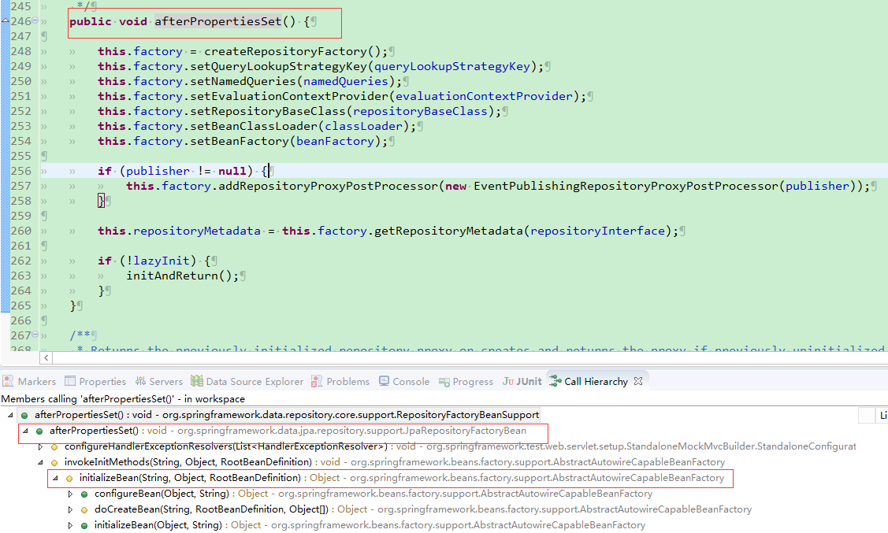
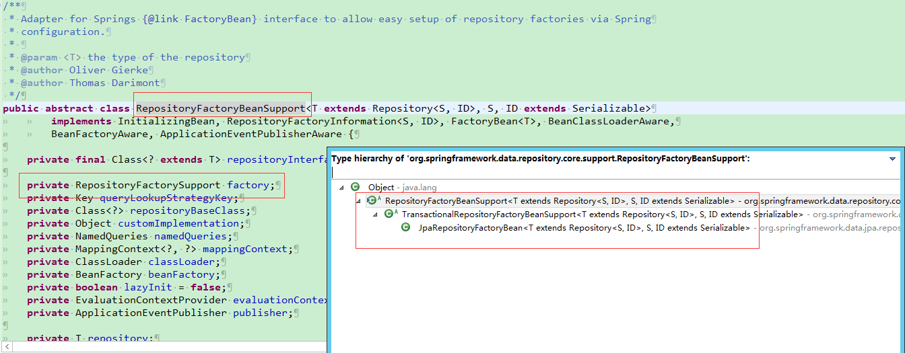
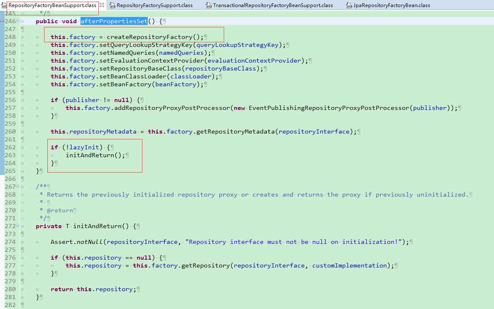
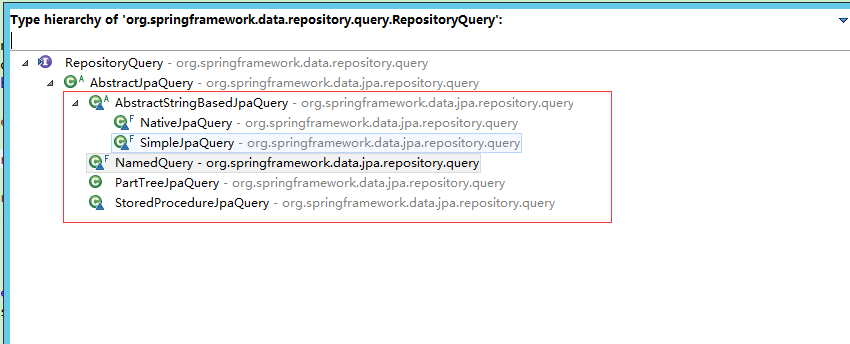
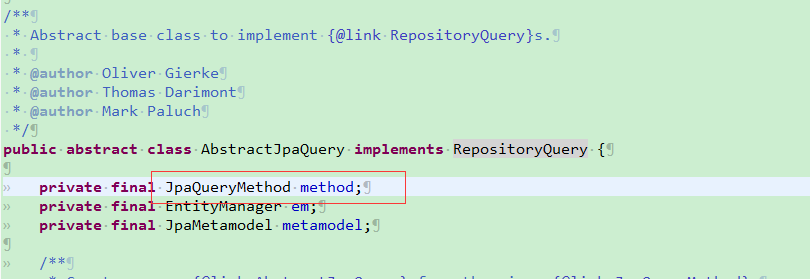

## spring-data-jpa 源码解析

#### 资源连接
* [spring-data-jpa官网链接](https://docs.spring.io/spring-data/jpa/docs/1.11.6.RELEASE/reference/html/)
* 分析源码，搭建demo，将日志级别调制debug从日志中可以看到相应的加载顺序，找到相应入口
* [参考博客](https://blog.csdn.net/gaolu/article/details/53415420)

#### 加载Repository接口(1)
* spring-data-jpa 创建及加载Repository接口
> spring-data-jpa在运行时和springframework框架对接，使用spring的@Repository注解生成Repository实例时，使用动态代理类的方式对Repository接口进行了实例化并放入spring容器中.<br/>
> 图为spring加载spring-data-repository顺序<br/>
> 

* 重要类解析
> RepositoryFactoryBeanSupport: javadoc解释 便捷的通过spring配置设置repository工厂.<br>
> 
> RepositoryFactorySupport是RepositoryFactoryBeanSupport的变量: javadoc解释:创建一个给定repository接口实例的工厂bean。创建一个实现配置的repository接口的代理，并应用一个advice将控制交给QueryExecuterMethodInterceptor,可以通过设置来配置查询检测策略,通过QueryLookupStrategy.Key来进行设置
> 
> RepositoryFactoryBeanSupport中持有一个私有RepositoryFactorySupport类变量,在执行afterPropertiesSet()方法时，通过createRepositoryFactory()方法,new了一个JpaRepositoryFactory实例并赋值给了类变量factory(RepositoryFactorySupport),每次通过spring扫描，每次扫描到一个接口就执行一次afterpropertiesSet方法,JpaRepositoryFactory构造器中，可以看到持有了entityManager对象
> 
> 构造完repositoryFactorySupport后并进行代理对象的生成,重要方法initAndReturn()通过调用getRepository方法创建代理类，创建代码如下：
```java
    /**
     * Returns a repository instance for the given interface backed by an instance providing implementation logic for
     * custom logic.
     * 
     * @param <T>
     * @param repositoryInterface
     * @param customImplementation
     * @return
     */
    @SuppressWarnings({ "unchecked" })
    public <T> T getRepository(Class<T> repositoryInterface, Object customImplementation) {
        RepositoryMetadata metadata = getRepositoryMetadata(repositoryInterface);
        Class<?> customImplementationClass = null == customImplementation ? null : customImplementation.getClass();
        RepositoryInformation information = getRepositoryInformation(metadata, customImplementationClass);
        validate(information, customImplementation);

        // 通过该方法获得代理目标：SimpleJpaRepository
        Object target = getTargetRepository(information);
        // 创建代理对象
        ProxyFactory result = new ProxyFactory();
        result.setTarget(target);
        result.setInterfaces(new Class[] { repositoryInterface, Repository.class });

        //下面对代理类进行准备
        result.addAdvice(SurroundingTransactionDetectorMethodInterceptor.INSTANCE);
        result.addAdvisor(ExposeInvocationInterceptor.ADVISOR);
        if (TRANSACTION_PROXY_TYPE != null) {
            result.addInterface(TRANSACTION_PROXY_TYPE);
        }
        for (RepositoryProxyPostProcessor processor : postProcessors) {
            processor.postProcess(result, information);
        }
        if (IS_JAVA_8) {
            result.addAdvice(new DefaultMethodInvokingMethodInterceptor());
        }
        // 创建QueryExecutorMethodInterceptor
        result.addAdvice(new QueryExecutorMethodInterceptor(information, customImplementation, target));
        return (T) result.getProxy(classLoader);
    }


    public QueryExecutorMethodInterceptor(RepositoryInformation repositoryInformation, Object customImplementation,
        Object target) {
        this.resultHandler = new QueryExecutionResultHandler();
        this.repositoryInformation = repositoryInformation;
        this.customImplementation = customImplementation;
        this.target = target;
        // 获取query的查询策略：queryLookupStrategyKey？注入方式是怎样的没找到
        QueryLookupStrategy lookupStrategy = getQueryLookupStrategy(queryLookupStrategyKey,
                RepositoryFactorySupport.this.evaluationContextProvider);
        lookupStrategy = lookupStrategy == null ? getQueryLookupStrategy(queryLookupStrategyKey) : lookupStrategy;
        Iterable<Method> queryMethods = repositoryInformation.getQueryMethods();
        if (lookupStrategy == null) {
            if (queryMethods.iterator().hasNext()) {
                throw new IllegalStateException("You have defined query method in the repository but "
                        + "you don't have any query lookup strategy defined. The "
                        + "infrastructure apparently does not support query methods!");
            }
            return;
        }
        SpelAwareProxyProjectionFactory factory = new SpelAwareProxyProjectionFactory();
        factory.setBeanClassLoader(classLoader);
        factory.setBeanFactory(beanFactory);
        for (Method method : queryMethods) {
            //通过query的查询策略获取到相应的reposioty，注：每个接口中的方法有相应的RepositoryQuery，最后将query放入到queryies中

            // RepositoryQuery 中根据不同的策略获取到不同的RepositoryQuery(有多种)对象，每个对象中存在一个JpaQueryMethod,
            RepositoryQuery query = lookupStrategy.resolveQuery(method, repositoryInformation, factory, namedQueries);
            invokeListeners(query);
            queries.put(method, query);
        }
}

// 问题，RepositoryFactoryBeanSupport 相关被初始化的位置？？？？？
```
> QueryLookupStrategy相关实现类: 图中的几个实现类都是于内部类的形式存在，是JpaQueryLookupStrategy的内部类
> 
> 
> 1.SimpleJpaQuery<br/>
方法头上@Query注解的nativeQuery属性缺省值为false，也就是使用JPQL，此时会创建SimpleJpaQuery实例，并通过两个StringQuery类实例分别持有query jpql语句和根据query jpql计算拼接出来的countQuery jpql语句；<br/>
>2.NativeJpaQuery<br/>
方法头上@Query注解的nativeQuery属性如果显式的设置为nativeQuery=true，也就是使用原生SQL，此时就会创建NativeJpaQuery实例；<br/>
>3.PartTreeJpaQuery<br/>
方法头上未进行@Query注解，将使用spring-data-jpa独创的方法名识别的方式进行sql语句拼接，此时在spring-data-jpa内部就会创建一个PartTreeJpaQuery实例；<br/>
>4.NamedQuery<br/>
使用javax.persistence.NamedQuery注解访问数据库的形式，此时在spring-data-jpa内部就会根据此注解选择创建一个NamedQuery实例<br/>
>5.StoredProcedureJpaQuery<br/>
顾名思义，在Repository接口的方法头上使用org.springframework.data.jpa.repository.query.Procedure注解，也就是调用存储过程的方式访问数据库，此时在spring-data-jpa内部就会根据@Procedure注解而选择创建一个StoredProcedureJpaQuery实例。

> JpaQueryMethod类
> 
> 
> QueryMethod类只有一个实现类，是JpaQueryMethod类：QueryMethod类持有RepositoryMetadata，Method，Parameters，domainClass等几个私有类变量。其中RepositoryMetadata存储的是repository接口的元数据。<br/>
> Parameters是一个JpaParameters实例，存储的是参数名和参数值的键值对集合，JpaParameters还包含一个内部类JpaParameter，它extends Parameter.<br/>
> JpaQueryMethod类中包含了解析JPA 2.1规范中的支持存储过程配置的若干类变量；以及QueryExtractor查询提取器实现，通过这个设置，可以根据不同的实现，从jpa的Query中提取原始JPA查询字符串，在这里，spring-data-jpa的缺省PersistenceProvider供应商实现是hibernate.