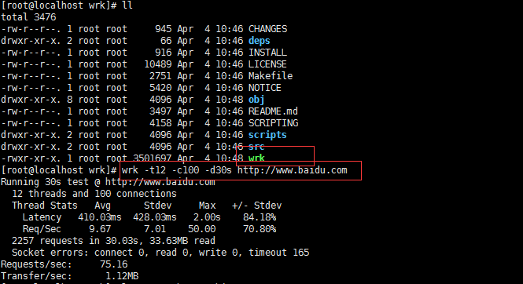
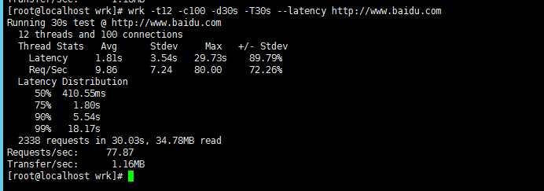
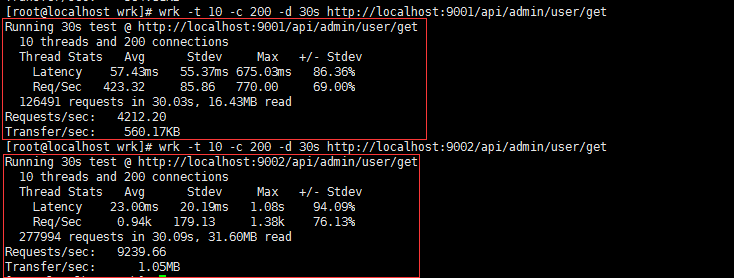

## spring-cloud-gateway 与 zuul性能测试

#### 资源连接
* [博客介绍](https://my.oschina.net/eacdy/blog/1620266)

#### 压测
* 根据博客介绍和官网issues，因此我们使用wrk进行压力测试

#### 测试工具 wrk
* 工具简介<br>
wrk 的一个很好的特性就是能用很少的线程压出很大的并发量，原因是它使用了一些操作系统特定的高性能 I/O 机制, 比如 select, epoll, kqueue 等。其实它是复用了 redis 的 ae 异步事件驱动框架. 确切的说 ae 事件驱动框架并不是 redis 发明的, 它来至于 Tcl的解释器 jim, 这个小巧高效的框架,因为被 redis 采用而更多的被大家所熟知.<br/>

* wrk GitHub源码<br>
[源码地址](https://github.com/wg/wrk)

* 安装<br/>
```shell
    git clone https://github.com/wg/wrk
    mv ./wrk /opt/
    cd wrk
    make
```



12 threads and 100 connections 这个能看懂英文的都知道啥意思: 用12个线程模拟100个连接. 对应的参数 -t 和 -c 可以控制这两个参数,一般线程数不宜过多. 核数的2到4倍足够了,多了反而因为线程切换过多造成效率降低.<br>

线程统计<br/>
Latency: 可以理解为响应时间, 有平均值, 标准偏差, 最大值, 正负一个标准差占比.<br/>
Req/Sec: 每个线程每秒钟的完成的请求数, 同样有平均值, 标准偏差, 最大值, 正负一个标准差占比.<br/>
一般我们来说我们主要关注平均值和最大值.标准差如果太大说明样本本身离散程度比较高. 有可能系统性能波动很大<br>

30秒钟总共完成请求数和读取数据量.<br> 
然后是错误统计, 上面的统计可以看到, 0个读错误, 165个超时. <br>
然后是所以线程总共平均每秒钟完成75.16个请求. 每秒钟读取1.12兆数据量<br>

wrk 默认超时时间是1秒. 这个有点短. 我一般设置为30秒. 这个看上去合理一点<br>
![] (./images/wrk/time-out.png)<br>
可以看到超时数就大大降低了, Socket errors 那行没有了

想看看响应时间的分布情况可以加上--latency参数:<br>

```shell
wrk -t12 -c100 -d30s -T30s --latency http://www.baidu.com
```
<br>
可以看到50%在0.4秒以内, %75在1.8s 以内. 看上去还不错

#### 使用wrk对gate-way与zuul进行测试
* 对zuul 进行测试
```shell
    wrk -t 10 -c 200 -d 30s http://localhost:9001/api/admin/user/get
    wrk -t 10 -c 200 -d 30s http://localhost:9002/api/admin/user/get
```
<br>
